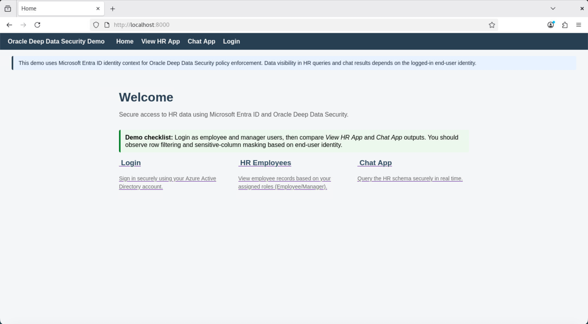
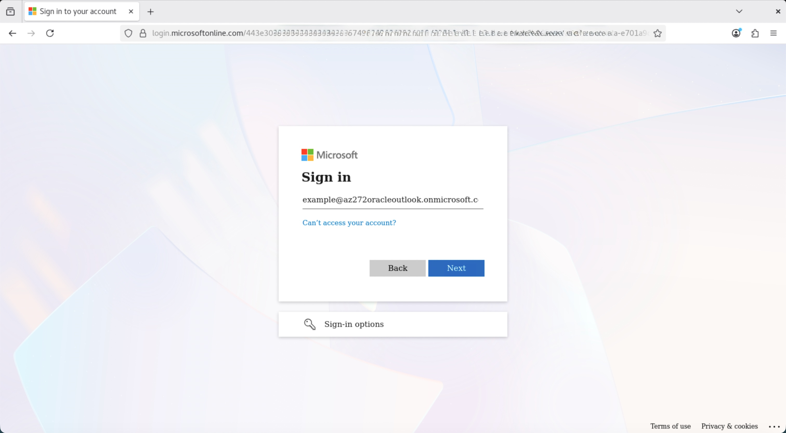
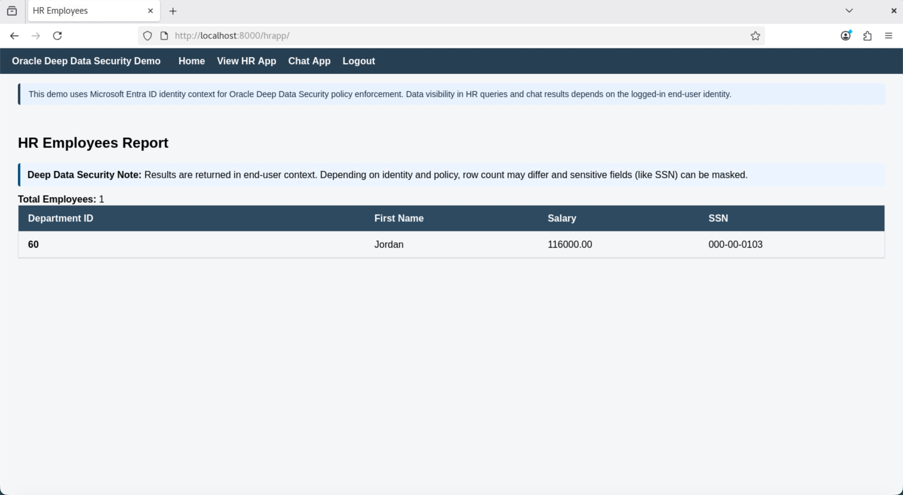
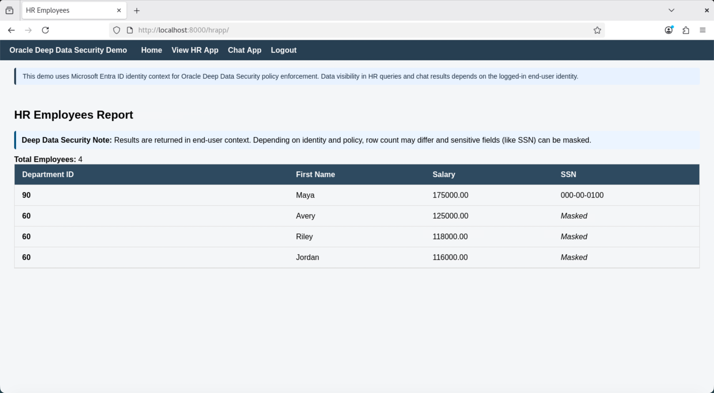
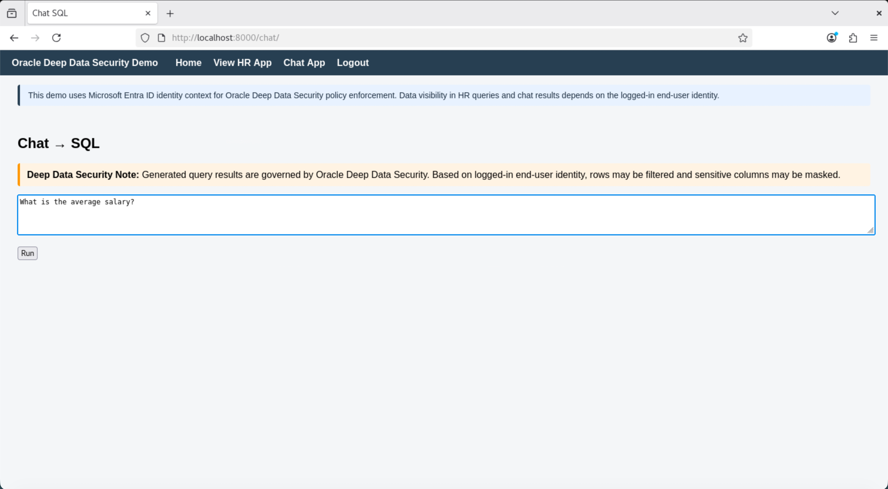
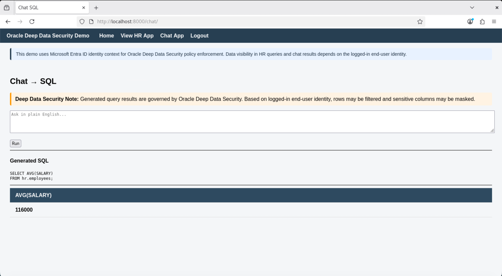
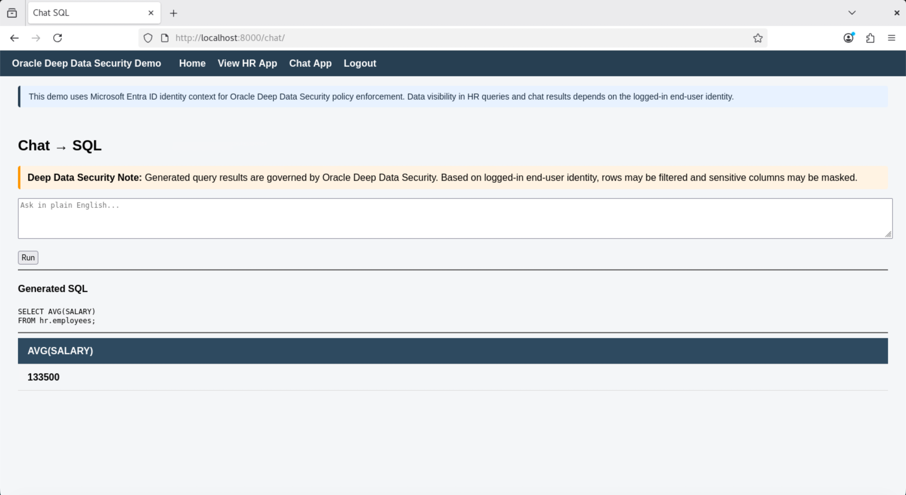

# Deep Data Security Django Demo

This Django app demonstrates Oracle **Deep Data Security (DDS)** behavior using Microsoft Entra ID OAuth tokens and end-user identity context.

## Quick Start

1. Create and activate a Python virtual environment.

2. Install required packages:

   ```bash
   pip install -r requirements.txt
   ```

3. Export all required environment variables. See **"1) Set environment
   variables"** below.

4. Ensure that the schemas have been created in the database (see README.md in
   main Azure Deep Data Security sample directory)

5. Run:

   ```bash
   python manage.py runserver
   ```

6. Open: `http://localhost:8000/`

---

## Overview (Django app)

This Django demo combines:

- **Azure login (MSAL)** for user authentication
- **Oracle Database** access via Django (`django.db.backends.oracle`)
- **Oracle end user security plugin** (`EndUserSecMiddleware`) for role-aware
  data access
- **OCI Generative AI** for chat-to-SQL

The UI demonstrates:

- HR employee data access
- natural-language to SQL query flow

Responses are filtered by logged-in user context (employee vs manager
visibility).

---

## Project Structure

```text
hr_demo/
    ├── manage.py
    ├── README.md
    ├── requirements.txt
    ├── main/
    │   ├── __init__.py
    │   ├── admin.py
    │   ├── apps.py
    │   ├── models.py
    │   ├── tests.py
    │   ├── urls.py
    │   ├── views.py
    │   ├── migrations/
    │   └── templates/
    └── myproject/
        ├── __init__.py
        ├── asgi.py
        ├── settings.py
        ├── urls.py
        └── wsgi.py
```

---

## Main Features

### 1) Azure AD Login / Logout

- `GET /login/` starts Azure AD authorization using
  `msal.ConfidentialClientApplication`.
- `GET /auth/callback/` exchanges code for token and stores access token in an
  `identity` cookie.
- `GET /logout/` clears cookie and redirects through Azure logout endpoint.

### 2) HR Data Access Demo

- `GET /hrapp/` runs Oracle SQL against `HR.EMPLOYEES` and renders employee
  rows.
- If access fails, app renders `no_access.html`.

### 3) Chat-to-SQL

- `GET /chat/` accepts plain-English prompt.
- App generates SQL, validates SELECT-only, and renders query results.

---

## URL Routes

- `/home/` → home page
- `/login/` → Azure login
- `/auth/callback/` → OAuth callback
- `/hrapp/` → HR employees view
- `/chat/` → chat-to-SQL UI
- `/logout/` → Azure logout


---

## What this demo proves

After login, the app runs HR and chat queries in the end-user context. Once
the end-user identity is applied, Deep Data Security policies enforce:

- **Row-level filtering** (who can see which rows)
- **Column-level masking** (which sensitive values are masked)

So an employee can see only their own data, while managers can see broader
data about employees managed by them, but still gets sensitive data masked for
reportees.

---

## Prerequisites

- Oracle Database version with **Deep Data Security** support
- Microsoft Entra ID account and app registrations
- Python 3.10+
- Required Python libraries (from `requirements.txt`):

```bash
python -m pip install -r requirements.txt
```

---

## Setup

### 1) Set environment variables

Set these values with your Azure, Oracle Database, and OCI details.

### User token acquisition

```bash
export AZURE_USER_CLIENT_CREDENTIAL="client secret"
export AZURE_USER_REDIRECT_URI="redirect URL"
```

### DB token acquisition

```bash
export DB_SPI_TYPE="spi type"
export DB_AUTH_FLOW="auth flow to use"
```

### OCI configuration

```bash
export OCI_CONFIG_FILE="Path to OCI CLI config file"
export OCI_ENDPOINT="inference endpoint URL"
export OCI_COMPARTMENT_ID="OCI compartment OCID"
```

### App runtime settings

```bash
export DB_POOL_MIN="min pool connections"
export DB_POOL_MAX="max pool connections"
export DB_POOL_INCREMENT="increment"
export DJANGO_SECRET_KEY="replace_me"
```

---

### 2) Run required SQL setup scripts

Ensure the database has been configured by following the README.md in the main
Azure Deep Data Security sample directory.

---

## Deep Data Security Activation and Run Flow

### 1) Why `EndUserSecMiddleware` is critical (DDS activation)

In this Django demo, Deep Data Security is activated through the middleware
configured in `myproject/settings.py`:

```python
# Enable Oracle Deep Data Security middleware to pass end-user identity
"oracledb.plugins.end_user_sec_provider.EndUserSecMiddleware",
```

Why this matters:

- This plugin captures end-user identity from the incoming request context. In
  this app, the `identity` cookie is set after Entra login.
- It then applies that identity to Oracle end-user security processing. This
  plays the same role as calling
  `provider.set_end_user_identity(end_user_identity)` in the standalone sample
  flows.
- Once identity is applied, DB calls run in end-user context, so Deep Data
  Security policies enforce row filtering and column masking.

Without this middleware, queries execute without the correct end-user identity context and DDS behavior will not be applied as intended.

> **Note:** For official python-oracledb Deep Data Security details, see:
> https://python-oracledb.readthedocs.io/en/latest/user_guide/connection_handling.html#deep-data-security

---

### 2) Run the Django Deep Data Security demo

In the root of the demo app, run:

```bash
python manage.py runserver
```

Open:

```text
http://localhost:8000/
```

Then test this flow:

1. Log in through Microsoft Entra ID.
2. Open **View HR App**.
3. Open **Chat App** and ask HR data questions.
4. Compare results for different users (employee vs manager).

---

## Expected behavior and interpretation

### Before end-user context

- HR table query may fail (`ORA-00942`) or return no authorized rows

### After end-user context

- HR query works with Deep Data Security policies applied

### Employee login interpretation

- Employee sees only authorized row(s), e.g. count = 1
- Shows employee-scoped visibility enforced by Deep Data Security

### Manager login interpretation

- Manager sees broader row set, e.g. count = 4
- Sensitive values (like SSN) remain policy-protected
- Typical pattern: manager’s own SSN visible, reportees masked.

This confirms Deep Data Security can provide broader manager-level row
visibility while still enforcing column-level protection.

---

## Demo Screenshots

The following screenshots illustrate the end-to-end Deep Data Security workflow.

### 1. Home Page

Landing page after starting the application.



---

### 2. Microsoft Entra ID Login

User authenticates through Microsoft Entra ID.



---

### 3. Employee View

Example showing an employee who can view only their own authorized records.



---

### 4. Manager View

Example showing a manager who can view their direct reports while sensitive
columns remain masked according to Deep Data Security policies.



---

### 5. Chat-to-SQL Interface

Natural language questions are translated into SQL and executed against the
database using the authenticated end-user identity.



---

## Chat-to-SQL Security Demonstration

The Chat application uses OCI Generative AI to translate natural-language
questions into SQL. The generated SQL is executed using the authenticated
user's end-user identity, allowing Oracle Deep Data Security policies to
transparently enforce row-level and column-level security.

### Scenario 1: Employee Query

**Prompt**

> What is the average salary?

The LLM generates a SQL query (for example):

```sql
SELECT AVG(salary) FROM hr.employees;
```

Although the SQL is identical for every user, Deep Data Security automatically
restricts the rows visible to the employee.

As a result:

- The calculation is performed only on the employee's authorized data.
- The employee receives an average salary based on the rows they are permitted to access.



---

### Scenario 2: Manager Query

A manager asks the same question:

> What is the average salary?

The LLM generates the same SQL statement:

```sql
SELECT AVG(salary) FROM hr.employees;
```

However, because the authenticated user is a manager, Deep Data Security allows
access to a broader set of employee records according to the configured security policies.

As a result:

- The average is calculated across all rows visible to that manager.
- The SQL does not change.
- Only the user's security context changes.



---

### Key Takeaway

This demonstration shows that:

- The LLM generates the same SQL for identical natural-language prompts.
- The application does not modify the SQL based on user roles.
- Oracle Deep Data Security enforces authorization entirely within the database.
- Different users receive different results because the database evaluates the query
using the authenticated end-user identity.

This approach enables developers to build AI-powered applications without embedding
authorization logic in prompts or application code, while ensuring data access policies
remain centrally managed and consistently enforced.
